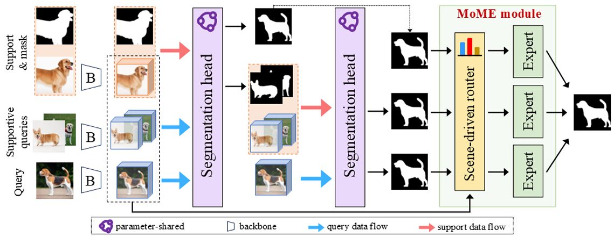

# Group-On: Boosting One-Shot Segmentation with  Supportive Query (ICME 2025 best paper candidates)
Group-On is a novel and effective approach for ONE-shot semantic segmentation, which packs multiple query images in batches for the benefit of mutual knowledge support within the same category. Please refer to [ICME 2025 oral paper](https://arxiv.org/abs/2404.11871) and the [arxiv version](https://arxiv.org/abs/2404.11871) for more technical details.

 
Figure 1: Illustrating GROUP-ON in the one-shot setting. 
Different from the conventional few-shot setting, a group of query images along with one support image is input into the model. After the coarse masks of all the query images are segmented, the supportive image-mask pairs function as pseudo support to segment the host query again. Eventually, the final result is produced by the proposed MoME module, where a flexible number of mask experts make decisions on candidate masks guided by a scene-driven router. Note that the host and supportive queries play an equal and interchangeable role.

## Requirements
Details are in the [requirements](https://github.com/diaoshaoyou/Group-On/blob/main/requirements.txt). Here is the basic setting:
```
Python=3.10
PyTorch=1.13.1
cuda=11.7
```

## Preparing Few-Shot Segmentation Datasets
Our datasets are in the [datasets](https://github.com/diaoshaoyou/Group-On/blob/main/datasets) and their preparation follows [HSNet](https://github.com/baiboat/HSNet):

> #### 1. PASCAL-5<sup>i</sup>
> Download PASCAL VOC2012 devkit (train/val data):
> ```bash
> wget http://host.robots.ox.ac.uk/pascal/VOC/voc2012/VOCtrainval_11-May-2012.tar
> ```
> Download PASCAL VOC2012 SDS extended mask annotations from our [[Google Drive](https://drive.google.com/file/d/10zxG2VExoEZUeyQl_uXga2OWHjGeZaf2/view?usp=sharing)].

> #### 2. COCO-20<sup>i</sup>
> Download COCO2014 train/val images and annotations: 
> ```bash
> wget http://images.cocodataset.org/zips/train2014.zip
> wget http://images.cocodataset.org/zips/val2014.zip
> wget http://images.cocodataset.org/annotations/annotations_trainval2014.zip
> ```
> Download COCO2014 train/val annotations from HSNet Google Drive: [[train2014.zip](https://drive.google.com/file/d/1cwup51kcr4m7v9jO14ArpxKMA4O3-Uge/view?usp=sharing)], [[val2014.zip](https://drive.google.com/file/d/1PNw4U3T2MhzAEBWGGgceXvYU3cZ7mJL1/view?usp=sharing)].
> (and locate both train2014/ and val2014/ under annotations/ directory).

> #### 3. FSS-1000
> Download FSS-1000 images and annotations from HSNet [[Google Drive](https://drive.google.com/file/d/1Fn-cUESMMF1pQy8Xff-vPQvXJdZoUlP3/view?usp=sharing)].

## Running 
Running ``train.sh`` for 1-support $N_q$-query training and ``test.sh`` for testing.

## License
This codebase is released under the Apache License 2.0 as in the LICENSE file. 

## Citation 
If you find this research work interesting and helpful, please cite our paper:
```
@inproceedings{zhou2025groupon,
  title={Group-On: Boosting One-Shot Segmentation with
 Supportive Query},
  author={Zhou, Hanjing and Yin, Mingze and Chen, Danny and Wu, Jian and Chen, Jintai},
  booktitle={International Conference on Multimedia and Expo},
  volume={0},
  number={0},
  pages={0--0},
  year={2025}
}
```
